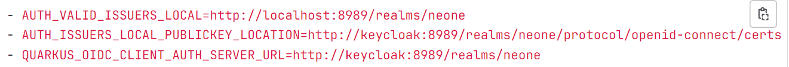

## OIDC SERVER IS NOT AVAILABLE解决方案

  这个问题是因为neone服务器的启动需要依赖OIDC服务器（Keycloak），而默认的`localhost:8989`配置方式不适用于docker网络，详情见《Docker网络概述(还没写)》或是Docker官方的[《Docker Networking overview》](https://docs.docker.com/network/)

  docker-compose.yml文件中配置环境变量`QUARKUS_OIDC_CLIENT_AUTH_SERVER_URL`

```shell
- QUARKUS_OIDC_CLIENT_AUTH_SERVER_URL=http://<KEYCLOAK_HOST>:<KEYCLOAK_PORT>/realms/neone
#此处配置的是OIDC服务器的地址
```

  **<KEYCLOAK_HOST>:<KEYCLOAK_PORT>替换为具体配置的Keycloak服务器ip+端口，如：192.168.40.121:8989**

> 注意：
>
>   1.需要先启动Keycloak，使用组合命令启动有时会因为Keycloak启动较慢导致NEONE检测不到Keycloak而启动失败，这种情况下需要重新启动NEONE
>
>   2.在一些关于该问题的解决方案中如[Unable to start ne-one 8080 server using docker compose](https://git.openlogisticsfoundation.org/wg-digitalaircargo/ne-one/-/issues/185)和[one-record-server-first-steps](https://github.com/ddoeppner/one-record-server-first-steps/blob/main/docker-compose/docker-compose.yml)中开发者使用了docker-compose的特性，即不使用服务的ip地址，而是通过服务名解析来配置
>
> 
>
> <div style="text-align: center">图1 使用服务名‘keycloak’配置</div>
>
> 这样配置可以在本地使NEONE正常启动。但是在后续与外部的订阅通知中会存在许多问题，建议使用外部ip+端口的形形式。
>
> 详细原因见《发布者无法自动通知的解决方案（还没写）》

